# Dual-FPGA Deterministic Trading Engine: Complete Design Specification

---

## 1. Problem Statement and Challenge

### 1a. The Core Challenge

Modern electronic trading systems demand **deterministic, sub-microsecond decision-making** that general-purpose CPUs cannot guarantee. Operating system scheduling, cache misses, and interrupt handling introduce unpredictable jitter (often 10-100 us) that makes software-based latency measurement unreliable and software-based trading non-deterministic.

We aim to build a **closed-loop, dual-FPGA trading testbed** that demonstrates:

- **Hardware-deterministic processing**: Every market quote is processed and responded to in a fixed, predictable number of clock cycles with zero jitter
- **Accurate hardware-based measurement**: Latency, throughput, and risk metrics computed entirely in FPGA fabric, not contaminated by OS/software overhead
- **Realistic market stress testing**: The system behaves differently under varying market conditions (calm, volatile, burst, adversarial), and all behavioral changes are measurable

### 1b. Why Two FPGAs?

A single FPGA looping back to itself would be trivial and unrealistic. Two physically separate boards force us to solve real engineering problems:

- **Physical-layer communication**: Designing a deterministic, high-throughput serial link
- **Clock domain crossing**: Two independent oscillators means proper CDC design
- **Separation of concerns**: Exchange and Trader are distinct entities with distinct logic, as in the real world
- **Demo credibility**: Judges see two physical boards with a visible cable carrying live data

### 1c. What This Is NOT

- This is NOT a full stock exchange (no deep order book, no multiple participants, no regulatory compliance)
- This is NOT algorithmic trading research (strategy is intentionally simple; the point is the hardware pipeline)
- This is NOT a networking project (the link is custom PL-to-PL, not Ethernet/TCP)

The project is an **FPGA systems engineering demonstration**: custom interconnect, real-time pipelines, hardware measurement, and a polished demo.

---

## 2. Proposed Solution

### 2a. Concept


| Board   | Role                                     | Analogy                      |
| ------- | ---------------------------------------- | ---------------------------- |
| Board A | **Exchange-Lite + Market Simulator**     | NASDAQ (simplified)          |
| Board B | **Trader** (strategy + risk + telemetry) | A trading firm's FPGA engine |
| Laptop  | **Dashboard** (read-only display)        | Operations monitoring screen |


Board A continuously generates synthetic market quotes (bid/ask prices for multiple symbols) and sends them to Board B over a custom PMOD link. Board B processes quotes, decides whether to trade, applies risk limits, and sends orders back. Board A matches orders against current prices and returns fill or reject responses. Board B measures the round-trip latency of every trade in hardware and exposes all metrics to a laptop dashboard.

### 2b. Why This Solution

- **Meaningful closed loop**: Quotes, orders, and fills form a realistic market data cycle with clear semantics
- **Demoable**: Judges see live throughput numbers, latency histograms, PnL, and regime changes in real time
- **Scalable complexity**: The baseline is achievable in 10 weeks; stretch goals (neural net strategy, order book) exist for extra credit
- **Teaching value**: Touches CDC, fixed-point DSP, AXI-Lite, state machines, PYNQ, and physical I/O

---

## 3. Design Requirements Matrix

Each requirement is traced from a **functional need** to a **technical approach** to a **quantitative acceptance metric**.

### 3a. Processing Speed


| Layer            | Description                                                                                                                                                                                               |
| ---------------- | --------------------------------------------------------------------------------------------------------------------------------------------------------------------------------------------------------- |
| **Functional**   | Board B must process incoming market quotes and generate order responses in real-time without buffering delays                                                                                            |
| **Technical**    | All data-plane logic implemented as a combinational/pipelined RTL pipeline in PL. No software, no OS, no cache, no interrupts in the critical path. Pipeline stages connected with valid/ready handshake. |
| **Quantitative** | Board B internal pipeline latency (quote arrives at link_rx output to order enters link_tx input): **<= 10 clock cycles = 100 ns at 100 MHz**. Constant and deterministic (0 ns jitter).                  |


### 3b. Throughput


| Layer            | Description                                                                                                                                                                                       |
| ---------------- | ------------------------------------------------------------------------------------------------------------------------------------------------------------------------------------------------- |
| **Functional**   | System must handle high quote rates including burst scenarios that stress the pipeline and link                                                                                                   |
| **Technical**    | 4-bit parallel PMOD link at 100 MHz. 128-bit frames. Internal FIFOs (64-deep) absorb transient bursts. Backpressure via ready signal prevents loss.                                               |
| **Quantitative** | Max sustained throughput: **3.03 million frames/sec per direction** (128b frame / 4-bit bus = 32 cycles + 1 gap = 33 cycles at 100 MHz). Minimum for demo: **100K quotes/sec** under CALM regime. |


### 3c. Board-to-Board Connectivity


| Layer            | Description                                                                                                                                                                   |
| ---------------- | ----------------------------------------------------------------------------------------------------------------------------------------------------------------------------- |
| **Functional**   | Two physically separate FPGA boards must exchange data in a full-duplex, deterministic manner                                                                                 |
| **Technical**    | Custom source-synchronous streaming link over 2x PMOD ribbon cables. 4-bit data + valid + forwarded clock + backpressure per direction. Async FIFO for clock domain crossing. |
| **Quantitative** | Wire latency per frame: **320 ns** (32 clock cycles). Link bit-error rate: **0** (digital LVCMOS signaling over 30 cm cable). Frame loss: **0** (hardware backpressure).      |


### 3d. Latency Measurement Accuracy


| Layer            | Description                                                                                                                                                                                                                                  |
| ---------------- | -------------------------------------------------------------------------------------------------------------------------------------------------------------------------------------------------------------------------------------------- |
| **Functional**   | System must measure and report the true round-trip trading latency without OS/software contamination                                                                                                                                         |
| **Technical**    | Board B embeds a 16-bit cycle counter timestamp in each ORDER. Board A echoes the timestamp in the FILL. Board B computes `latency = current_cycle - echoed_timestamp` entirely in PL. Results accumulated into a 16-bin hardware histogram. |
| **Quantitative** | Measurement resolution: **10 ns** (1 clock cycle at 100 MHz). Histogram bins: 16 bins x 32 cycles each (covers 0 to 5.12 us). Additional scalar metrics: min, max, sum, count (for average). p50/p99 computed on laptop from histogram.      |


### 3e. Laptop Telemetry


| Layer            | Description                                                                                                                                                                                                                                                                |
| ---------------- | -------------------------------------------------------------------------------------------------------------------------------------------------------------------------------------------------------------------------------------------------------------------------- |
| **Functional**   | A laptop dashboard must display real-time trading metrics for the demo audience                                                                                                                                                                                            |
| **Technical**    | Board B PS (ARM/PYNQ) reads AXI-Lite status registers at 20 Hz and sends JSON-formatted data over USB-UART (FTDI) to the laptop. Laptop runs a Python Plotly Dash web dashboard.                                                                                           |
| **Quantitative** | Dashboard refresh rate: **20 Hz** (50 ms). Metrics displayed: **8 panels** (throughput gauges, latency histogram, per-symbol position, PnL chart, regime indicator, risk rejects, link health, order/fill counters). UART baud: **115200** minimum (upgradable to 921600). |


### 3f. Determinism and Reproducibility


| Layer            | Description                                                                                                                                                                                   |
| ---------------- | --------------------------------------------------------------------------------------------------------------------------------------------------------------------------------------------- |
| **Functional**   | Given the same LFSR seed and regime sequence, the system should produce the same price trajectory and trade sequence                                                                          |
| **Technical**    | LFSR-based PRNG with configurable seed. All logic synchronous to 100 MHz clock. No non-deterministic elements (no metastability in data path, proper CDC at link boundary).                   |
| **Quantitative** | Jitter in pipeline latency: **0 cycles** (fully pipelined, no variable-latency operations). Reproducibility: identical LFSR seed + regime + parameters = identical quote/order/fill sequence. |


### 3g. Stress Resilience


| Layer            | Description                                                                                                                                        |
| ---------------- | -------------------------------------------------------------------------------------------------------------------------------------------------- |
| **Functional**   | System must remain stable under all 4 stress regimes without data loss or hang                                                                     |
| **Technical**    | FIFO backpressure prevents overflow. Error counters detect any anomalies. Watchdog can be added as stretch.                                        |
| **Quantitative** | Sustained operation: **>10 minutes** per regime without frame loss (link_error_count = 0). FIFO max fill: monitored, must stay below 75% capacity. |


### 3h. Risk Management


| Layer            | Description                                                                                                                                                                                                                              |
| ---------------- | ---------------------------------------------------------------------------------------------------------------------------------------------------------------------------------------------------------------------------------------- |
| **Functional**   | Trader must enforce position, rate, and loss limits before sending any order                                                                                                                                                             |
| **Technical**    | Three independent checks in risk_manager module, evaluated in 1 clock cycle. Any failure suppresses the order and increments a reject counter.                                                                                           |
| **Quantitative** | Risk check latency: **1 clock cycle** (10 ns). Position limit: configurable, default +/-100 shares. Order rate limit: configurable, default 1000 orders per 1 ms window. Loss halt: configurable, default -$16.00 in Q16.16 fixed point. |


---

## 4. High-Level Solution / Demo Approach

### 4a. What the Judges See

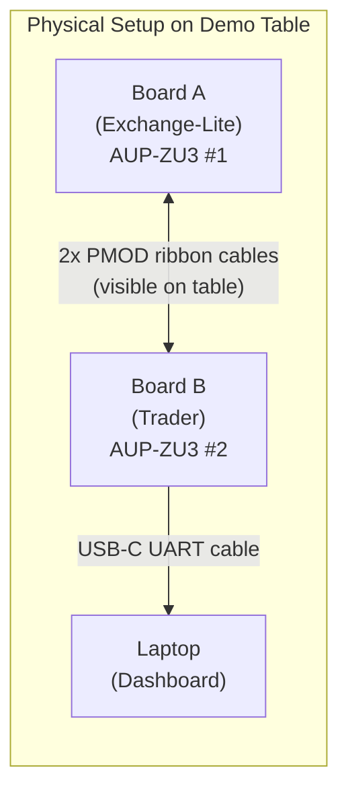


The laptop screen shows a live dashboard with 8 panels updating at 20 Hz. The audience can see:

1. **Throughput gauges**: quotes/sec, orders/sec, fills/sec -- numbers change as regime changes
2. **Latency histogram**: bar chart shifts left/right as conditions change
3. **Position bars**: per-symbol position goes positive/negative as trades execute
4. **PnL line**: running profit/loss, clearly affected by regime
5. **Regime label**: shows current stress mode (CALM / VOLATILE / BURST / ADVERSARIAL)
6. **Risk rejects**: counter jumps when position limits hit
7. **Link health**: error count stays at 0 (proving reliability)
8. **Scalar stats**: p50, p99, max latency in nanoseconds

### 4b. Demo Flow (scripted for presentation)


| Step | Action                                                          | What Audience Sees                                        |
| ---- | --------------------------------------------------------------- | --------------------------------------------------------- |
| 1    | Power on both boards, PYNQ boots                                | LEDs come on, dashboard connects                          |
| 2    | Run config script on Board A (sets initial prices, CALM regime) | Dashboard shows quotes flowing                            |
| 3    | Enable trading on Board B (press button or run script)          | Orders and fills begin, PnL moves                         |
| 4    | Switch to VOLATILE regime (flip switch on Board A)              | Spread widens, PnL swings larger, latency unchanged       |
| 5    | Switch to BURST regime                                          | Quote rate jumps to millions/sec, throughput gauge spikes |
| 6    | Switch to ADVERSARIAL regime                                    | Risk rejects spike, position limits hit, PnL volatile     |
| 7    | Return to CALM                                                  | System stabilizes, demonstrating resilience               |
| 8    | Show that link errors = 0 throughout                            | Proves reliability under stress                           |


---

## 5. System Specification: Hardware

### 5a. Board A Internal Architecture

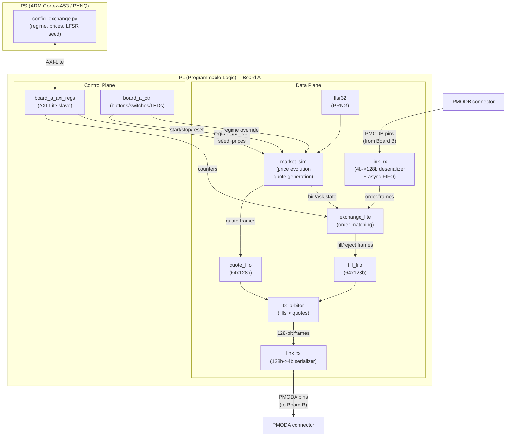


**Key data flows on Board A:**

1. `market_sim` generates QUOTE frames (128-bit) using LFSR-driven price random walk
2. Quotes go into `quote_fifo`, then through `tx_arbiter` to `link_tx` and out PMODA
3. Orders arrive on PMODB into `link_rx`, parsed by `exchange_lite`
4. `exchange_lite` compares order limit price vs current bid/ask, produces FILL or REJECT
5. Fills go into `fill_fifo`, then through `tx_arbiter` (with priority over quotes) to `link_tx`

### 5b. Board B Internal Architecture

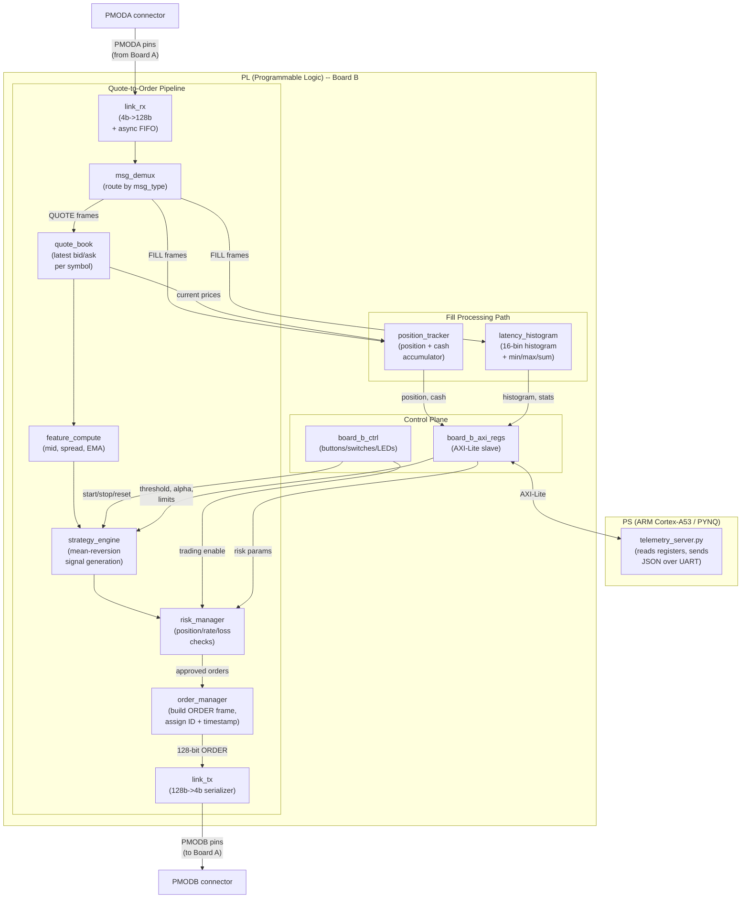


**Key data flows on Board B:**

1. Quotes arrive on PMODA → `link_rx` → `msg_demux` routes to `quote_book`
2. `quote_book` updates latest bid/ask → `feature_compute` computes mid, spread, EMA
3. `strategy_engine` generates BUY/SELL/NONE signal → `risk_manager` checks limits
4. If approved: `order_manager` builds ORDER frame → `link_tx` → PMODB to Board A
5. Fills arrive from Board A → `msg_demux` routes to `position_tracker` (updates position/cash) and `latency_histogram` (records round-trip latency)
6. PS reads all counters/metrics via AXI-Lite at 20 Hz → sends to laptop over UART

### 5c. Board-to-Board Link Layer (detailed)

**Physical interface (per direction):**

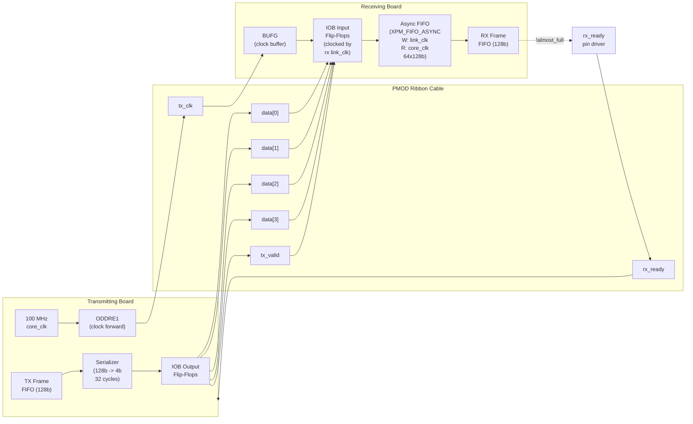


**Serialization timing (one frame):**

```
Cycle:  0    1    2    3    ...  30   31   32   33
        |----|----|----|----|    |----|----|----|
data:  [N0] [N1] [N2] [N3] ... [N30][N31][IDLE]
valid:  _/^^^^^^^^^^^^^^^^^^^^^^^^^^^^^^^^^^^^\_____
        ↑ frame start                         ↑ inter-frame gap (>=1 cycle)

N0 = frame[127:124] (MSB nibble first)
N31 = frame[3:0] (LSB nibble last)
```

**Critical design note on clock routing:** The forwarded tx_clk arrives on a PMOD pin that may not be a clock-capable (CCIO) pin. On UltraScale+, we route it through a BUFG/BUFGCE with general fabric routing. This works at 100 MHz. Required XDC constraint:

```
set_property CLOCK_DEDICATED_ROUTE FALSE [get_nets {link_clk_ibuf}]
create_clock -period 10.000 -name link_rx_clk [get_ports {pmoda_pin8}]
```

**NOTE**: The exact PMOD pin net names must be obtained from the AUP-ZU3 reference manual / board XDC file. This is an implementation detail to resolve during Vivado build.

**Fallback if clock routing causes issues**: Eliminate forwarded clock entirely. Use local 100 MHz clock to sample data with a 2-FF synchronizer on tx_valid. At 100 MHz with ~50 ppm frequency offset between boards, cumulative drift over 32 cycles is < 0.002 cycles -- negligible. This sacrifices some timing margin but is simpler.

### 5d. Clock Domains and Reset Strategy

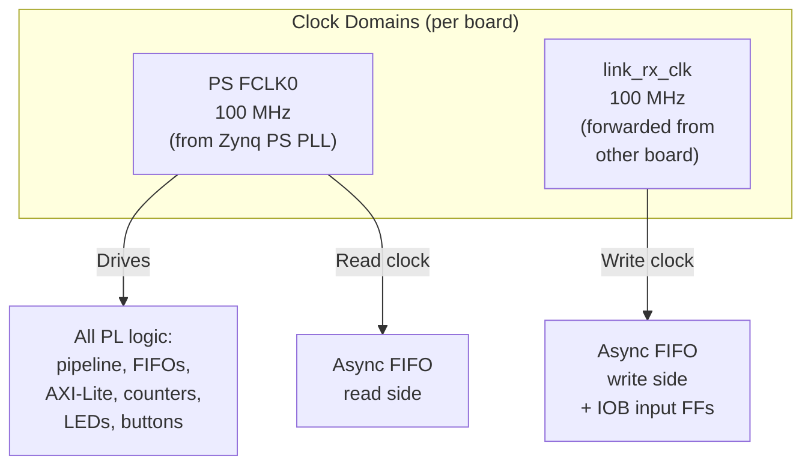


**Design choice**: We use PS FCLK0 (configurable, set to 100 MHz) as the single core clock for ALL PL logic. This eliminates clock domain crossings between AXI-Lite and our data-plane. The ONLY CDC boundary is at the link_rx async FIFO.

**Reset**: Active-high synchronous reset, deasserted synchronously. Triggered by:

- PS system reset (power-on or software-initiated)
- Control register bit [1] write (software reset)
- Button 2 press (hardware reset via `board_x_ctrl`)

Reset holds for 16 cycles, clears all FIFOs, counters, state machines, and positions.

### 5e. FPGA Resource Budget (per board, estimated)


| Resource    | Board A Est. | Board B Est. | Available (ZU3EG) | Max Util. |
| ----------- | ------------ | ------------ | ----------------- | --------- |
| LUTs        | ~3,000       | ~5,000       | 70,560            | ~7%       |
| FFs         | ~2,500       | ~4,000       | 141,120           | ~3%       |
| BRAM (18Kb) | ~4           | ~6           | 432               | ~1.4%     |
| DSP48E2     | ~1           | ~4           | 360               | ~1.1%     |


No resource concerns whatsoever. Massive headroom for stretch goals.

---

## 6. System Specification: Software

### 6a. PS Software Stack

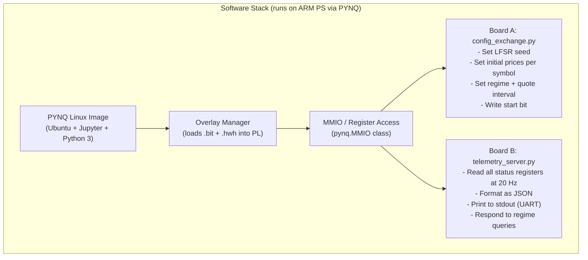


**Board A PS script responsibilities:**

1. Load Board A overlay
2. Write configuration registers (regime parameters, initial prices, LFSR seed)
3. Set start bit to begin quote generation
4. Optionally: respond to laptop commands to change regime (stretch)

**Board B PS script responsibilities:**

1. Load Board B overlay
2. Write configuration registers (strategy threshold, EMA alpha, risk limits)
3. Enter telemetry loop: read status registers at 20 Hz, format as JSON, print to UART
4. The UART output is captured by the laptop dashboard via pyserial

### 6b. Laptop Dashboard

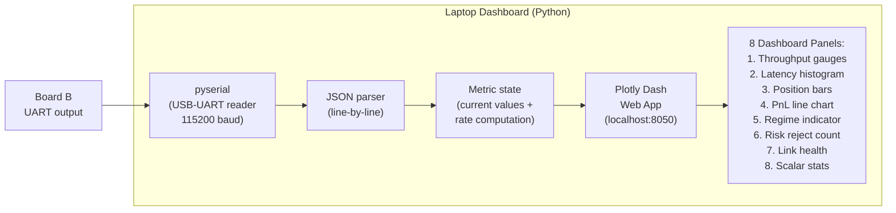


**Rate computation**: Counters are monotonic. Dashboard computes rates as:
`rate = (counter_now - counter_prev) / time_delta`

**p50/p99 from histogram**: Walk bins cumulatively; p50 is the bin where cumulative count >= 50% of total; p99 is where cumulative >= 99%.

---

## 7. Detailed System Block Diagram: All Submodules

### 7a. Complete Module List

**22 RTL modules + 4 testbenches:**


| #   | Module                 | Board  | Type           | Key Resources       | Description                                        |
| --- | ---------------------- | ------ | -------------- | ------------------- | -------------------------------------------------- |
| 1   | `hft_pkg.sv`           | Shared | Package        | --                  | Type definitions, constants, message structs       |
| 2   | `lfsr32.sv`            | Shared | Logic          | 32 FFs              | 32-bit Galois LFSR pseudo-random generator         |
| 3   | `debounce.sv`          | Shared | Logic          | ~20 FFs             | Button debouncer (20 ms filter)                    |
| 4   | `link_tx.sv`           | Shared | Logic          | ~200 LUTs           | 128-bit to 4-bit frame serializer with valid/ready |
| 5   | `link_rx.sv`           | Shared | Logic + BRAM   | 1 BRAM (async FIFO) | 4-bit to 128-bit deserializer + CDC async FIFO     |
| 6   | `market_sim.sv`        | A      | Logic + DSP    | ~500 LUTs, 1 DSP    | Price random walk, quote frame builder             |
| 7   | `exchange_lite.sv`     | A      | Logic          | ~300 LUTs           | Order match: compare limit vs bid/ask              |
| 8   | `tx_arbiter.sv`        | A      | Logic          | ~100 LUTs           | Strict-priority mux (fills > quotes)               |
| 9   | `board_a_axi_regs.sv`  | A      | AXI-Lite slave | ~400 LUTs           | Register file: config + status                     |
| 10  | `board_a_ctrl.sv`      | A      | Logic          | ~100 LUTs           | Button/switch/LED logic                            |
| 11  | `board_a_top.sv`       | A      | Structural     | --                  | Top-level wiring                                   |
| 12  | `msg_demux.sv`         | B      | Logic          | ~50 LUTs            | Route frames by msg_type field                     |
| 13  | `quote_book.sv`        | B      | Logic          | ~200 FFs            | 4-symbol register file for latest quotes           |
| 14  | `feature_compute.sv`   | B      | Logic + DSP    | 2 DSP               | Mid, spread, EMA (fixed-point multiply)            |
| 15  | `strategy_engine.sv`   | B      | Logic          | ~200 LUTs           | Mean-reversion comparison + signal generation      |
| 16  | `risk_manager.sv`      | B      | Logic          | ~300 LUTs           | 3 parallel checks, suppress/approve decision       |
| 17  | `order_manager.sv`     | B      | Logic          | ~200 LUTs           | Assign order_id, capture timestamp, build frame    |
| 18  | `position_tracker.sv`  | B      | Logic + DSP    | 1 DSP               | Signed position + 48-bit cash accumulator          |
| 19  | `latency_histogram.sv` | B      | Logic          | ~300 LUTs           | 16 bins + min/max/sum/count registers              |
| 20  | `board_b_axi_regs.sv`  | B      | AXI-Lite slave | ~500 LUTs           | Register file: config + status + histogram         |
| 21  | `board_b_ctrl.sv`      | B      | Logic          | ~100 LUTs           | Button/switch/LED logic                            |
| 22  | `board_b_top.sv`       | B      | Structural     | --                  | Top-level wiring                                   |


**Testbenches:**


| #   | Testbench       | Tests                                                           |
| --- | --------------- | --------------------------------------------------------------- |
| 23  | `tb_link.sv`    | link_tx + link_rx loopback, verify frame integrity              |
| 24  | `tb_board_a.sv` | Full Board A with synthetic orders, verify quote gen + matching |
| 25  | `tb_board_b.sv` | Full Board B with synthetic quotes + fills, verify pipeline     |
| 26  | `tb_system.sv`  | Board A + Board B with behavioral link, full closed loop        |


### 7b. Module Interface Specifications

Every data-plane module uses a **valid/ready handshake** inspired by AXI-Stream:

```
Producer:  out_frame[127:0], out_valid
Consumer:  out_ready
Transfer occurs when: out_valid && out_ready (both high on same clock edge)
```

**Detailed per-module I/O:**

`**link_tx` -- Frame Serializer:**

```
Inputs:
  clk, rst
  frame_in[127:0]     -- frame to send
  frame_valid          -- frame available
  rx_ready_pin         -- backpressure from remote receiver (synchronized)
Outputs:
  frame_ready          -- can accept new frame (feedback to producer)
  tx_data_pins[3:0]   -- to PMOD data pins
  tx_valid_pin         -- to PMOD valid pin
  tx_clk_pin           -- to PMOD clock pin (forwarded via ODDRE1)
```

`**link_rx` -- Frame Deserializer + CDC:**

```
Inputs:
  core_clk, rst
  rx_data_pins[3:0]   -- from PMOD data pins
  rx_valid_pin         -- from PMOD valid pin
  rx_clk_pin           -- from PMOD clock pin (through BUFG)
Outputs:
  frame_out[127:0]     -- received frame (in core_clk domain)
  frame_out_valid      -- frame available
  rx_ready_pin         -- to PMOD ready pin (backpressure)
  link_error_count[31:0] -- sequence/framing errors detected
```

`**market_sim` -- Quote Generator:**

```
Inputs:
  clk, rst
  start                -- enable quote generation
  regime[1:0]          -- current regime selection
  quote_interval[31:0] -- cycles between quote rounds
  num_symbols[2:0]     -- active symbol count (1-4)
  sym_init_mid[0:3]    -- initial mid price per symbol (array of price_t)
  sym_init_spread[0:3] -- initial spread per symbol
  lfsr_seed[31:0]      -- PRNG seed (loaded on reset)
Outputs:
  quote_frame[127:0]   -- generated QUOTE frame
  quote_valid          -- frame available
  quote_ready          -- input: downstream can accept
  bid_price_out[0:3]   -- current bid per symbol (to exchange_lite)
  ask_price_out[0:3]   -- current ask per symbol (to exchange_lite)
```

`**exchange_lite` -- Order Matcher:**

```
Inputs:
  clk, rst
  order_frame[127:0]   -- incoming ORDER from link_rx
  order_valid
  bid_price[0:3]       -- current bid prices from market_sim
  ask_price[0:3]       -- current ask prices from market_sim
Outputs:
  order_ready          -- can accept order
  fill_frame[127:0]    -- FILL or REJECT response
  fill_valid
  fill_ready           -- input: downstream can accept
```

`**feature_compute` -- EMA + Features:**

```
Inputs:
  clk, rst
  bid_price, ask_price  -- from quote_book (current symbol)
  symbol_id[7:0]        -- which symbol just updated
  quote_valid            -- new quote arrived
  ema_alpha[15:0]        -- Q0.16 EMA smoothing factor
Outputs:
  mid_price              -- (bid + ask) / 2
  spread                 -- ask - bid
  ema_price              -- exponential moving average of mid
  deviation              -- mid - ema (signed, for strategy)
  feature_valid          -- features ready
  symbol_id_out          -- pass-through symbol ID
```

`**strategy_engine` -- Trading Signal Generator:**

```
Inputs:
  clk, rst
  deviation             -- from feature_compute (signed Q16.16)
  mid_price, spread     -- from feature_compute
  bid_price, ask_price  -- from quote_book (for order pricing)
  symbol_id[7:0]        -- which symbol
  feature_valid         -- new features available
  threshold[31:0]       -- strategy threshold (Q16.16)
  base_qty[15:0]        -- order size
Outputs:
  order_side             -- BUY or SELL
  order_price[31:0]      -- limit price
  order_qty[15:0]        -- quantity
  order_symbol[7:0]      -- symbol
  signal_valid           -- trade signal generated (NONE = signal_valid low)
```

`**risk_manager` -- Risk Gate:**

```
Inputs:
  clk, rst
  signal_valid           -- from strategy
  order_side, order_price, order_qty, order_symbol -- from strategy
  position[0:3]          -- current position per symbol (from position_tracker)
  total_pnl[31:0]        -- current PnL (from position_tracker)
  max_position[15:0]     -- configurable limit
  max_order_rate[15:0]   -- configurable limit
  max_loss[31:0]         -- configurable limit (Q16.16)
  trading_enable         -- from board_b_ctrl (switch)
Outputs:
  approved_valid         -- order approved and passed through
  rejected               -- order rejected (for counter)
  order_side, order_price, order_qty, order_symbol -- pass-through
  risk_halt              -- max loss breached, all trading stopped
```

`**latency_histogram` -- Hardware Histogram:**

```
Inputs:
  clk, rst
  fill_valid             -- fill received
  ts_echo[15:0]          -- echoed timestamp from fill
  cycle_counter[15:0]    -- current cycle counter [15:0]
Outputs (directly readable by AXI regs):
  hist_bins[0:15]        -- 16 x 32-bit bin counters
  lat_min[15:0]          -- minimum observed latency
  lat_max[15:0]          -- maximum observed latency
  lat_sum[47:0]          -- sum of all latencies (for average)
  lat_count[31:0]        -- number of samples
```

### 7c. Do We Need to Implement a Processor?

**No.** The Zynq UltraScale+ already includes a hard ARM Cortex-A53 quad-core processor (the PS). We use it to:

- Boot PYNQ Linux
- Run Python configuration/telemetry scripts
- Read/write AXI-Lite registers

We do NOT need:

- A MicroBlaze soft processor (the base overlay uses MicroBlaze for PMOD I/O, but we replace the base overlay entirely with our own)
- A RISC-V or any custom processor
- Any instruction memory, data memory, or program counter in PL

All real-time logic is implemented as **RTL state machines and combinational pipelines**. The PS is purely for slow-path control and monitoring.

### 7d. Button / Switch / LED Control Logic

**Board A (`board_a_ctrl.sv`):**


| I/O          | Pin Type | Function                                                           |
| ------------ | -------- | ------------------------------------------------------------------ |
| Switch [1:0] | Input    | Regime select: 00=CALM, 01=VOLATILE, 10=BURST, 11=ADVERSARIAL      |
| Switch [2]   | Input    | Source override: 0=use PS register for regime, 1=use switches      |
| Switch [3]   | Input    | Reserved                                                           |
| Switch [4:7] | Input    | Reserved                                                           |
| Button 0     | Input    | Start market sim (edge-detected, sets start bit)                   |
| Button 1     | Input    | Stop market sim (edge-detected, clears start bit)                  |
| Button 2     | Input    | Reset all counters and state                                       |
| Button 3     | Input    | Reserved                                                           |
| LED [3:0]    | Output   | Binary display of active regime (blinking = running)               |
| LED [7:4]    | Output   | Link activity (flash on each frame sent/received)                  |
| RGB LED 0    | Output   | Regime: Green=CALM, Yellow=VOLATILE, Red=BURST, Purple=ADVERSARIAL |
| RGB LED 1    | Output   | Link: Green=healthy (no errors), Red=errors detected               |


**Board B (`board_b_ctrl.sv`):**


| I/O          | Pin Type | Function                                               |
| ------------ | -------- | ------------------------------------------------------ |
| Switch [0]   | Input    | Trading enable: 0=armed (observe only), 1=live trading |
| Switch [1]   | Input    | Reserved (future: strategy select)                     |
| Switch [2:7] | Input    | Reserved                                               |
| Button 0     | Input    | Start (edge-detected, sets start bit)                  |
| Button 1     | Input    | Stop (edge-detected, clears start bit)                 |
| Button 2     | Input    | Reset counters, positions, histogram                   |
| Button 3     | Input    | Reserved                                               |
| LED [3:0]    | Output   | Order activity (flash on each order sent)              |
| LED [7:4]    | Output   | Fill activity (flash on each fill received)            |
| RGB LED 0    | Output   | PnL: Green=profit, Red=loss, Off=zero                  |
| RGB LED 1    | Output   | Risk: Green=OK, Yellow=near limit (>80%), Red=halted   |


**Debounce logic**: All 4 buttons pass through `debounce.sv` (20 ms filter = 2M cycles at 100 MHz). A shift register samples the button input; output changes only when all samples agree.

**Edge detection**: After debounce, a 1-cycle pulse is generated on the rising edge (button press). The `board_x_ctrl` module OR's this pulse with the corresponding AXI-Lite register write, so either hardware button or software command can trigger the same action.

### 7e. Operational State Machines

**Board A operational flow:**

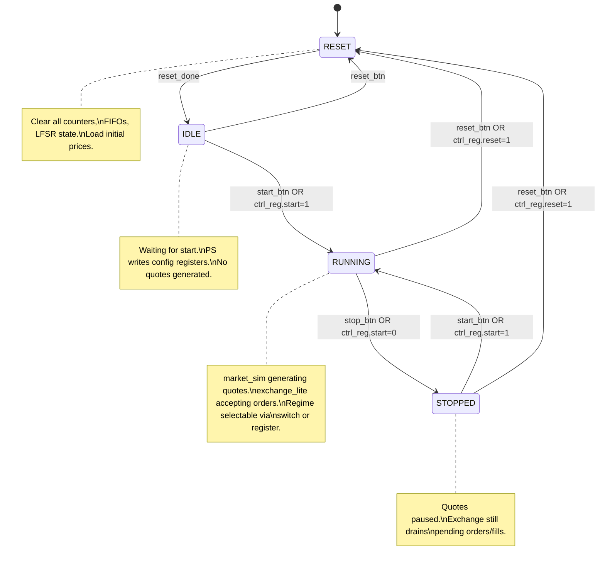


**Board B operational flow:**

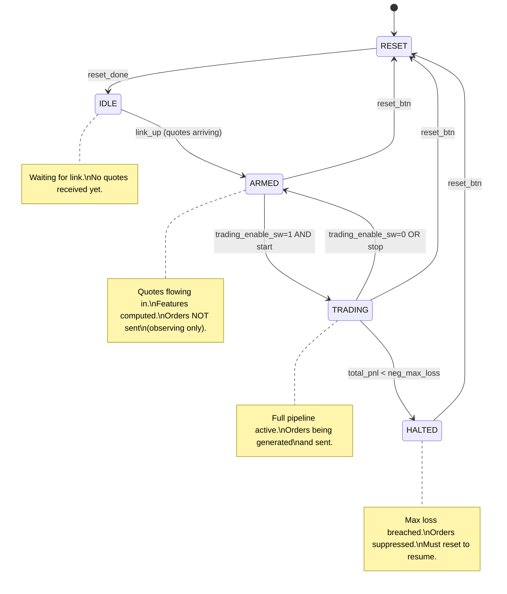


### 7f. Vivado Block Design (per board)

Both boards share the same block design structure (only the custom IP differs):

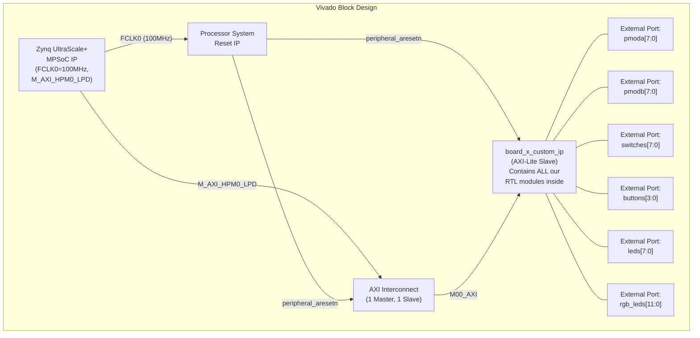


**Implementation approach**: Use Vivado's "Create and Package New IP" wizard to create an AXI4-Lite peripheral. Vivado auto-generates the AXI handshake logic. We edit the generated template to add our register read/write behavior and instantiate all our data-plane modules inside the IP wrapper.

The `.bit` (bitstream) and `.hwh` (hardware handoff) files are exported and placed on the SD card for PYNQ to load as an overlay.

---

## 8. Detailed Testing Plan

### 8a. Unit Testing (Simulation -- per module)

Every module gets a self-checking testbench. Simulation tool: Vivado XSIM or ModelSim.


| Module                | Stimulus                            | Key Checks                                                                                 | Edge Cases                                                                               |
| --------------------- | ----------------------------------- | ------------------------------------------------------------------------------------------ | ---------------------------------------------------------------------------------------- |
| `lfsr32`              | Provide seed, clock for 100 cycles  | Output never zero, sequence matches known LFSR output for given polynomial                 | Seed = 0 (should be prevented), seed = all-ones                                          |
| `link_tx`             | Feed 5 frames, monitor pins         | Correct nibble sequence (MSB first), valid high for 32 cycles, gap between frames          | Back-to-back frames, rx_ready deassertion mid-idle                                       |
| `link_rx`             | Drive pins with known frames        | Assembled frame matches expected 128-bit value, frame_out_valid pulses correctly           | Glitch on valid, missing nibble (error detection)                                        |
| `link_tx` + `link_rx` | Loopback (tx pins → rx pins)        | 1000 random frames sent = 1000 identical frames received                                   | Maximum rate (back-to-back), intermittent pauses                                         |
| `market_sim`          | Set regime=CALM, run 100 quotes     | Prices within expected range, spread > 0, seq_num incrementing, correct symbol round-robin | Regime change mid-run, all 4 regimes                                                     |
| `exchange_lite`       | Inject BUY order at ask_price       | FILL returned with fill_price = ask_price, order_id echoed                                 | BUY below ask (REJECT), SELL above bid (REJECT), exact boundary prices                   |
| `tx_arbiter`          | Simultaneous quote + fill available | Fill sent first, then quote                                                                | Only quotes (no starvation check), only fills, alternating                               |
| `msg_demux`           | Feed mixed QUOTE + FILL frames      | Quotes routed to quote port, fills to fill port                                            | Unknown msg_type (discard + error count), back-to-back same type                         |
| `feature_compute`     | Provide known bid/ask sequence      | mid = (bid+ask)/2 exactly, EMA converges to expected value within tolerance                | Very large price jump, spread = 0, alpha = 0 and alpha = 65535                           |
| `strategy_engine`     | Provide deviation > threshold       | BUY/SELL signal generated with correct price and qty                                       | deviation exactly at threshold, deviation = 0                                            |
| `risk_manager`        | Position at limit, then signal      | Order rejected, risk_reject increments                                                     | Position at max-1 (should approve), rate limit exactly at max, PnL at -max_loss boundary |
| `order_manager`       | Approved signal arrives             | ORDER frame built with correct fields, order_id incrementing, timestamp captured           | Rapid back-to-back orders (ID wraparound test)                                           |
| `position_tracker`    | Inject BUY fill then SELL fill      | Position and cash update correctly                                                         | Large qty overflow test, alternating buy/sell returning to zero                          |
| `latency_histogram`   | Inject fills with known ts_echo     | Correct bin incremented, min/max updated                                                   | Latency = 0, latency > max bin (overflow bin), timestamp wraparound                      |


### 8b. Integration Testing (Simulation)


| Test               | Setup                                                                                                 | Duration                           | Pass Criteria                                                              |
| ------------------ | ----------------------------------------------------------------------------------------------------- | ---------------------------------- | -------------------------------------------------------------------------- |
| Board A standalone | market_sim + exchange_lite + link_tx/rx looped back internally (orders generated by a stub)           | 10,000 quotes                      | All counters consistent, no FIFO overflow                                  |
| Board B standalone | Synthetic quote generator replaces link_rx; feed known quote sequence                                 | 5,000 quotes                       | Orders generated match expected strategy output, positions correct         |
| Full system        | Board A top + Board B top connected via behavioral link model (wire delay modeled as 2-cycle latency) | 50,000 quotes across all 4 regimes | Zero frame loss, PnL computation matches golden model, histogram non-empty |


### 8c. Hardware Bring-Up Phases

```mermaid
flowchart TD
    P1["Phase 1: LED Blinker\nBuild minimal overlay\nwith just clock + LED toggle.\nVerifies: Vivado flow,\nPYNQ boot, bitstream load"]
    P2["Phase 2: AXI-Lite Smoke Test\nAdd AXI-Lite slave with\none R/W register.\nVerify: PS can read/write\nfrom Python (MMIO)"]
    P3["Phase 3: Board A Standalone\nLoad full Board A overlay.\nVerify: market_sim generates\nquotes (check counters via\nMMIO, capture with ILA)"]
    P4["Phase 4: Board B Standalone\nLoad full Board B overlay\nwith internal synthetic\nquote generator.\nVerify: pipeline exercises,\norders generated, histogram\npopulated"]
    P5["Phase 5: Link Smoke Test\nConnect PMOD cables.\nBoard A sends counter frames.\nBoard B checks sequence.\nVerify: zero sequence errors,\nrx_frame_count matches\ntx_frame_count"]
    P6["Phase 6: One-Way Quotes\nBoard A sends real quotes.\nBoard B receives, updates\nquote_book.\nVerify: quote counters match,\nprices update on Board B"]
    P7["Phase 7: Closed Loop\nEnable orders on Board B.\nBoard A matches and returns\nfills.\nVerify: fill count > 0,\nposition != 0, PnL updating"]
    P8["Phase 8: Dashboard\nConnect laptop UART.\nRun telemetry + dashboard.\nVerify: all 8 panels updating"]
    P9["Phase 9: Stress Test\nCycle all 4 regimes.\nRun 10+ minutes per regime.\nVerify: zero link errors,\nno FIFO overflow, stable PnL"]

    P1 --> P2 --> P3 --> P4 --> P5 --> P6 --> P7 --> P8 --> P9
```


**ILA (Integrated Logic Analyzer) usage**: In phases 3-7, we add ILA cores (Vivado debug IP) to monitor key signals: link data/valid/ready, FIFO fill levels, frame counters, and state machine states. ILA is removed from the final bitstream to save resources (though at <10% utilization, it can stay).

### 8d. Stress Testing Protocol


| Regime          | Duration | Key Metrics to Monitor                                               | Expected Behavior                                           |
| --------------- | -------- | -------------------------------------------------------------------- | ----------------------------------------------------------- |
| CALM            | 10 min   | Quote rate ~100K/s, steady PnL, low risk rejects                     | Stable, predictable                                         |
| VOLATILE        | 10 min   | Wider PnL swings, same throughput, possibly more risk rejects        | PnL oscillates more                                         |
| BURST           | 10 min   | Quote rate ~3M/s, check FIFO fill levels, verify no overflow         | Throughput gauge maxes out, FIFO fill rises but stays < 75% |
| ADVERSARIAL     | 10 min   | High risk rejects, rapid PnL changes, position limits frequently hit | Risk system heavily engaged                                 |
| RAPID SWITCHING | 10 min   | Switch regime every 30 sec via switch                                | No glitches on transition, counters remain consistent       |


### 8e. Acceptance Criteria Matrix


| Criterion              | Metric                                         | Target                                    | How Verified                                 |
| ---------------------- | ---------------------------------------------- | ----------------------------------------- | -------------------------------------------- |
| Functional correctness | Closed loop runs                               | Quotes -> Orders -> Fills cycle completes | Dashboard shows all counters incrementing    |
| Determinism            | Pipeline latency variance                      | 0 cycles jitter                           | Histogram shows single-bin concentration     |
| Throughput             | Max sustained quote rate                       | >= 1M quotes/sec (BURST)                  | Dashboard throughput gauge                   |
| Latency                | Round-trip (quote -> fill measured on Board B) | < 2 us typical                            | Histogram p99 < 2 us                         |
| Reliability            | Frame loss                                     | 0 frames lost in 10 min                   | link_error_count = 0, tx_count = rx_count    |
| Risk enforcement       | Position limit                                 | Never exceeded                            | max(abs(position)) <= max_position always    |
| Telemetry              | Dashboard liveness                             | All 8 panels update at >= 10 Hz           | Visual confirmation                          |
| Stress resilience      | All 4 regimes                                  | Zero errors in each                       | link_error_count = 0 after full stress suite |


---

## 9. Risk Analysis and Mitigations


| Risk                                    | Likelihood | Impact           | Mitigation                                                                                                         |
| --------------------------------------- | ---------- | ---------------- | ------------------------------------------------------------------------------------------------------------------ |
| PMOD clock routing fails (non-CCIO pin) | Medium     | High (no link)   | Fallback: mesochronous sampling with local clock (validated by analysis: drift < 0.002 cycles over 32-cycle frame) |
| AXI-Lite integration issues             | Medium     | Medium           | Use Vivado IP wizard to auto-generate AXI slave template; reduces hand-coding errors                               |
| Fixed-point overflow in PnL             | Low        | Medium           | Use 48-bit accumulator for cash; add saturation logic                                                              |
| FIFO overflow under BURST               | Low        | High (data loss) | 64-deep FIFOs + backpressure; BURST rate is below link capacity (both ~3M/s)                                       |
| PYNQ overlay packaging errors           | Medium     | Medium           | Follow PYNQ docs exactly; test Phase 1-2 early to validate flow                                                    |
| Time pressure (2 people, 10 weeks)      | High       | High             | Strict phase-gated milestones; cut stretch goals early if behind                                                   |
| Board hardware failure                  | Low        | Very High        | Handle boards carefully; no hot-plugging PMOD while powered; have USB-C PD supplies rated 9V/3A minimum            |


---

## 10. Bill of Materials


| Item                                     | Qty | Purpose                        | Notes                                      |
| ---------------------------------------- | --- | ------------------------------ | ------------------------------------------ |
| AUP-ZU3 board                            | 2   | Main compute platforms         | Already available (assumed)                |
| MicroSD card (32GB, UHS-I)               | 2   | PYNQ boot image + scripts      | One per board                              |
| USB-C PD power supply (9V/3A+)           | 2   | Board power                    | Must support USB-C PD negotiation          |
| USB-C cable (data)                       | 2   | JTAG/UART to laptop            | For programming and serial console         |
| Standard PMOD ribbon cable (12-pin, 2x6) | 2   | Board-to-board data link       | One for PMODA (A->B), one for PMODB (B->A) |
| Laptop                                   | 1   | Vivado, dashboard, programming | Already available                          |


**Optional:**


| Item                                | Qty | Purpose                               |
| ----------------------------------- | --- | ------------------------------------- |
| Female-female jumper wires (2.54mm) | 20  | Backup if PMOD cables have pin issues |
| USB-C to Ethernet adapter           | 2   | Alternative telemetry path (stretch)  |
| External monitor + HDMI cable       | 1   | Demo display for dashboard            |


---

## Appendix A: Items Requiring Reference Manual Confirmation

The following details must be verified against the AUP-ZU3 reference manual during implementation. They do not affect the architecture but are needed for XDC constraints and Vivado setup:

1. **Exact PMOD pin net names** (e.g., `JA1`, `JA2`, etc.) and their FPGA ball assignments
2. **Which PMOD pins (if any) are on clock-capable (CCIO) pairs** -- affects link_clk routing strategy
3. **I/O voltage standard for PMOD** (likely LVCMOS33 or LVCMOS18) -- needed for XDC IOSTANDARD property
4. **Switch, button, LED pin assignments** -- needed for XDC
5. **FCLK0 default frequency in PYNQ image** -- expected 100 MHz, should confirm
6. **UART baud rate limit** via FTDI chip -- 115200 is safe, 921600 may be supported
7. **AXI address space** -- Vivado address editor assigns this; 0x4000_0000 is placeholder

