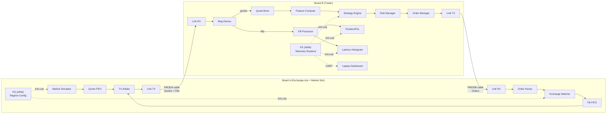
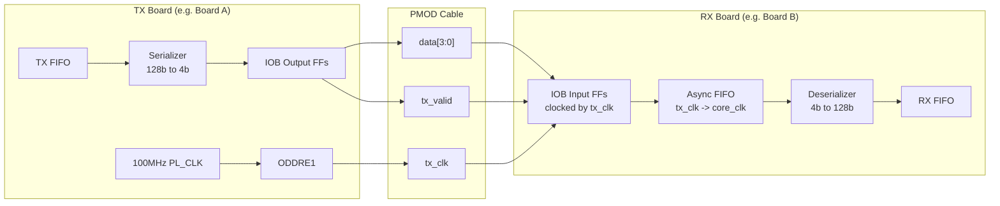
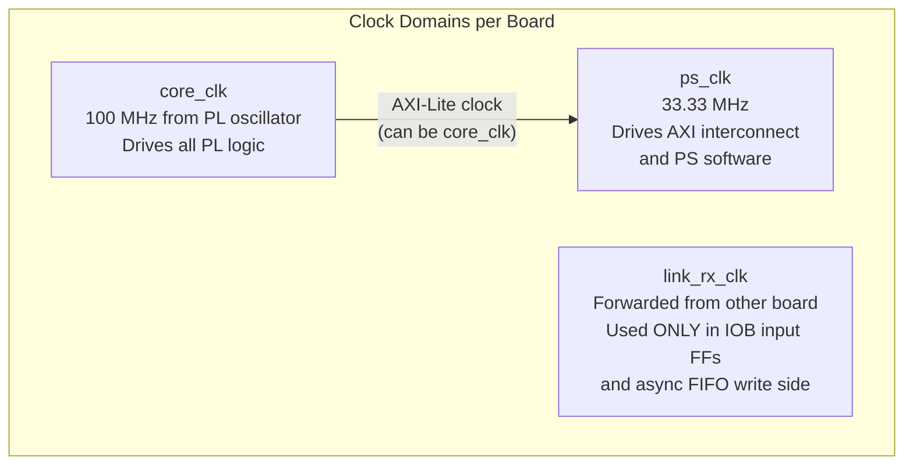

# Dual-FPGA HFT Capstone -- Complete Implementation Specification

---

## 1. System Architecture Overview

Two AUP-ZU3 boards form a closed trading loop. Board A generates synthetic market quotes and matches incoming orders. Board B consumes quotes, runs a trading strategy, applies risk checks, sends orders, processes fills, and reports metrics to a laptop dashboard.




**Key design principles:**

- All real-time data processing in PL (SystemVerilog)
- PS (ARM / PYNQ) only for configuration and telemetry readout
- Latency measured entirely in Board B's PL clock domain (no cross-board sync needed)
- Modules use valid/ready handshake (AXI-Stream style) internally for clean pipelining

---

## 2. Number Representation


| Type               | Width   | Format           | Range                 | Example                      |
| ------------------ | ------- | ---------------- | --------------------- | ---------------------------- |
| Price              | 32 bits | Unsigned Q16.16  | 0 to 65535.9999       | $150.25 = 32'h0096_4000      |
| Signed Price / PnL | 32 bits | Signed Q16.16    | -32768 to +32767.9999 | -$5.50 = 32'hFFFA_8000       |
| Quantity           | 16 bits | Unsigned integer | 0 to 65535            | 100 shares = 16'h0064        |
| Symbol ID          | 8 bits  | Unsigned integer | 0 to 255              | Symbol 0 = "AAPL"            |
| Order ID           | 16 bits | Unsigned integer | 0 to 65535            | Wrapping counter             |
| Timestamp          | 16 bits | Unsigned integer | 0 to 65535            | Low 16 bits of cycle counter |


**Q16.16 arithmetic rules:**

- Addition/subtraction: direct (same format, check overflow)
- Multiplication (price x qty): `result_48 = price_32 * qty_16` -- result is Q32.16, keep upper 32 bits as Q16.16 PnL, or keep all 48 bits in accumulator
- Division: avoid in PL; use shift approximations where needed

---

## 3. Message Format (128-bit Universal Frame)

Every message is exactly **128 bits (16 bytes)**. A 4-bit message type in the MSBs determines interpretation.

### 3a. QUOTE (Board A -> Board B) -- msg_type = 4'h1

```
Bit Range   Width  Field         Description
----------- -----  ------------- ------------------------------------
[127:124]    4     msg_type      4'h1 = QUOTE
[123:116]    8     symbol_id     Which instrument (0-7 for demo)
[115:114]    2     regime        00=CALM, 01=VOLATILE, 10=BURST, 11=ADVERSARIAL
[113:112]    2     reserved      Zero
[111:80]    32     bid_price     Best bid price (Q16.16)
[79:48]     32     ask_price     Best ask price (Q16.16)
[47:32]     16     bid_size      Shares available at bid
[31:16]     16     ask_size      Shares available at ask
[15:0]      16     seq_num       Monotonic sequence number (for debug/loss detection)
```

### 3b. ORDER (Board B -> Board A) -- msg_type = 4'h2

```
Bit Range   Width  Field         Description
----------- -----  ------------- ------------------------------------
[127:124]    4     msg_type      4'h2 = ORDER
[123:116]    8     symbol_id     Which instrument
[115]        1     side          0=BUY, 1=SELL
[114:112]    3     reserved      Zero
[111:80]    32     limit_price   Max buy price or min sell price (Q16.16)
[79:64]     16     quantity      Shares to trade
[63:48]     16     order_id      Assigned by Board B (wrapping counter)
[47:32]     16     timestamp     Board B cycle counter [15:0] at send time
[31:0]      32     reserved      Zero
```

### 3c. FILL (Board A -> Board B) -- msg_type = 4'h3

```
Bit Range   Width  Field         Description
----------- -----  ------------- ------------------------------------
[127:124]    4     msg_type      4'h3 = FILL
[123:116]    8     symbol_id     Which instrument
[115]        1     side          Echoed from order
[114:112]    3     status        000=FILLED, 001=REJECTED
[111:80]    32     fill_price    Execution price (Q16.16)
[79:64]     16     fill_qty      Shares filled (0 if rejected)
[63:48]     16     order_id      Echoed from order
[47:32]     16     ts_echo       Echoed timestamp (for round-trip latency)
[31:0]      32     reserved      Zero
```

### 3d. SystemVerilog Package (`hft_pkg.sv`)

```systemverilog
package hft_pkg;
  typedef logic [31:0] price_t;
  typedef logic signed [31:0] pnl_t;
  typedef logic [15:0] qty_t;
  typedef logic [7:0]  symbol_t;
  typedef logic [15:0] order_id_t;
  typedef logic [15:0] timestamp_t;

  typedef enum logic [3:0] {
    MSG_QUOTE  = 4'h1,
    MSG_ORDER  = 4'h2,
    MSG_FILL   = 4'h3
  } msg_type_e;

  typedef enum logic [1:0] {
    REGIME_CALM       = 2'b00,
    REGIME_VOLATILE   = 2'b01,
    REGIME_BURST      = 2'b10,
    REGIME_ADVERSARIAL = 2'b11
  } regime_e;

  localparam int NUM_SYMBOLS   = 4;
  localparam int FRAME_WIDTH   = 128;
  localparam int LINK_DATA_W   = 4;
  localparam int NIBBLES_PER_FRAME = FRAME_WIDTH / LINK_DATA_W; // 32
endpackage
```

---

## 4. PMOD Link Layer (Board-to-Board Communication)

### 4a. Physical Pin Mapping

Each board has PMODA (8 signal pins) and PMODB (8 signal pins). Two standard PMOD ribbon cables connect the boards. **Each cable carries one direction of traffic plus a backpressure signal returning the other way.**

**PMODA cable (Quotes + Fills: Board A TX --> Board B RX):**


| PMOD Pin | Signal Name | Direction   | Description                    |
| -------- | ----------- | ----------- | ------------------------------ |
| 1        | data[0]     | A out, B in | Data nibble bit 0              |
| 2        | data[1]     | A out, B in | Data nibble bit 1              |
| 3        | data[2]     | A out, B in | Data nibble bit 2              |
| 4        | data[3]     | A out, B in | Data nibble bit 3              |
| 7        | tx_valid    | A out, B in | High during frame transmission |
| 8        | tx_clk      | A out, B in | Forwarded 100 MHz clock        |
| 9        | rx_ready    | B out, A in | Receiver can accept data       |
| 10       | spare       | --          | Unused (tie low)               |


**PMODB cable (Orders: Board B TX --> Board A RX):**


| PMOD Pin | Signal Name | Direction   | Description                    |
| -------- | ----------- | ----------- | ------------------------------ |
| 1        | data[0]     | B out, A in | Data nibble bit 0              |
| 2        | data[1]     | B out, A in | Data nibble bit 1              |
| 3        | data[2]     | B out, A in | Data nibble bit 2              |
| 4        | data[3]     | B out, A in | Data nibble bit 3              |
| 7        | tx_valid    | B out, A in | High during frame transmission |
| 8        | tx_clk      | B out, A in | Forwarded 100 MHz clock        |
| 9        | rx_ready    | A out, B in | Receiver can accept data       |
| 10       | spare       | --          | Unused (tie low)               |


### 4b. Throughput Math

- Data width: 4 bits per clock cycle
- Link clock: 100 MHz
- Frame size: 128 bits = 32 nibbles = 32 clock cycles
- Inter-frame gap: 1 cycle minimum
- Max throughput: 100M / 33 = **~3.03 million frames/sec per direction**
- Latency per frame: **320 ns** (wire time only)

### 4c. Source-Synchronous Clocking

TX side forwards the 100 MHz PL clock via an ODDRE1 primitive to the tx_clk pin. RX side uses the incoming tx_clk to capture data into IOB flip-flops, then crosses into the local core clock domain via an asynchronous FIFO.




### 4d. Frame Serialization Protocol

**TX side (`link_tx.sv`):**

1. Wait in IDLE until TX FIFO is non-empty AND rx_ready=1
2. Pop 128-bit frame from TX FIFO
3. Drive nibble_count = 0..31: `data[3:0] = frame[127 - nibble_count*4 -: 4]` (MSB-first)
4. Assert tx_valid = 1 for all 32 cycles
5. After nibble 31, return to IDLE (tx_valid = 0 for >= 1 cycle)

**RX side (`link_rx.sv`):**

1. Wait in IDLE for tx_valid rising edge (0 -> 1 transition)
2. Capture nibbles for 32 cycles into a 128-bit shift register
3. After 32 nibbles, push assembled frame into async FIFO
4. Return to IDLE
5. Assert rx_ready = !(async_fifo_almost_full)

### 4e. Async FIFO Specification

- Use Xilinx XPM_FIFO_ASYNC (simplest, pre-verified)
- Write clock: incoming tx_clk
- Read clock: local 100 MHz core_clk
- Width: 128 bits
- Depth: 64 entries (ample -- FIFO almost never fills)
- Almost-full threshold: 48 (de-assert rx_ready when 48+ entries)

---

## 5. Board A: Market Simulator (`market_sim.sv`)

### 5a. Per-Symbol State (registers, not BRAM -- only 4 symbols)

```
For each symbol s (s = 0..NUM_SYMBOLS-1):
  mid_price[s]    : price_t   (Q16.16, initialized via AXI-Lite)
  spread[s]       : price_t   (Q16.16, initialized via AXI-Lite)
  bid_size[s]     : qty_t     (fixed or slowly varying)
  ask_size[s]     : qty_t
  seq_num[s]      : logic [15:0] (monotonic counter)
```

### 5b. Price Evolution (LFSR-based random walk)

**LFSR**: 32-bit Galois LFSR, polynomial `32'hD0000001` (taps at bits 31, 30, 28, 0). Maximal length (2^32 - 1 cycles). Seed configurable via AXI-Lite.

**Price update per quote (once per quote_interval cycles):**

```
raw_step = lfsr[4:0]                     // 5-bit unsigned [0..31]
signed_step = $signed({1'b0, raw_step}) - 16  // signed [-16..+15]
step_scaled = signed_step * step_size[regime] // step_size varies by regime

mid_price[s] = mid_price[s] + step_scaled
bid_price = mid_price[s] - (spread[s] >> 1)
ask_price = mid_price[s] + (spread[s] >> 1)
```

**Regime parameters (hardcoded defaults, overridable via AXI-Lite):**


| Regime      | step_size (Q16.16)    | base_spread (Q16.16) | quote_interval (cycles) |
| ----------- | --------------------- | -------------------- | ----------------------- |
| CALM        | 0x0000_0100 (~0.004)  | 0x0000_2000 (~0.125) | 1000 (10 us, 100K qps)  |
| VOLATILE    | 0x0000_1000 (~0.0625) | 0x0000_8000 (~0.5)   | 500 (5 us, 200K qps)    |
| BURST       | 0x0000_0100 (~0.004)  | 0x0000_2000 (~0.125) | 33 (330 ns, ~3M qps)    |
| ADVERSARIAL | 0x0000_4000 (~0.25)   | 0x0001_0000 (~1.0)   | 100 (1 us, 1M qps)      |


### 5c. Quote Generation State Machine

```
States: IDLE -> GEN_QUOTE -> WAIT_TIMER
- IDLE: wait for start bit in control register
- GEN_QUOTE: update prices for symbol[sym_counter], build 128-bit QUOTE frame,
             push to quote_fifo, increment sym_counter (wraps at NUM_SYMBOLS)
- WAIT_TIMER: countdown timer from quote_interval to 0, then -> GEN_QUOTE
```

Round-robin across symbols: each timer tick generates a quote for the next symbol in sequence.

---

## 6. Board A: Exchange-Lite Matcher (`exchange_lite.sv`)

### 6a. Matching Rule (intentionally simple)

On receiving an ORDER:

1. Look up current `bid_price[symbol_id]` and `ask_price[symbol_id]` (from Market Sim's state)
2. If side == BUY and limit_price >= ask_price: **FILL** at ask_price
3. If side == SELL and limit_price <= bid_price: **FILL** at bid_price
4. Otherwise: **REJECT**

No resting orders, no order book depth, no partial fills in V1. Every order either fills immediately or is rejected.

### 6b. Module Interface

```
Inputs:  order (128-bit frame from link_rx FIFO), order_valid, bid_price[0..3], ask_price[0..3]
Outputs: fill (128-bit frame to fill_fifo), fill_valid
Latency: 2 clock cycles (1 to read + compare, 1 to construct fill frame)
```

### 6c. TX Arbiter (`tx_arbiter.sv`)

Multiplexes two sources onto one Link TX:

- **fill_fifo** (high priority -- fills are latency-sensitive)
- **quote_fifo** (low priority -- quotes are continuous)

Strict priority: always drain fill_fifo first. Only send quotes when fill_fifo is empty. This guarantees minimum fill latency.

---

## 7. Board B: Trader Pipeline

### 7a. Message Demux (`msg_demux.sv`)

Reads frames from link_rx FIFO, routes based on msg_type:

- msg_type == QUOTE (4'h1) -> quote processing path
- msg_type == FILL (4'h3) -> fill processing path
- Other -> discard + increment error counter

### 7b. Quote Book (`quote_book.sv`)

Registers storing latest quote per symbol:

```
For each symbol s:
  best_bid[s], best_ask[s], bid_size[s], ask_size[s]
```

Updated on every incoming QUOTE. Readable by Feature Compute on same cycle (forwarding).

### 7c. Feature Compute (`feature_compute.sv`)

Computes per-symbol features from quotes:

**Mid-price:**

```
mid[s] = (best_bid[s] + best_ask[s]) >> 1
```

**Spread:**

```
spread[s] = best_ask[s] - best_bid[s]
```

**Exponential Moving Average (EMA) of mid-price:**

```
// alpha = Q0.16 (e.g., 0.1 = 6554, configurable via AXI-Lite)
// ema_new = (alpha * mid + (65536 - alpha) * ema_old) >> 16

mult_a  = alpha * mid[s];              // 16 x 32 = 48-bit (1 DSP48)
mult_b  = (16'd65536 - alpha) * ema[s]; // 16 x 32 = 48-bit (1 DSP48)
ema[s]  = (mult_a + mult_b) >> 16;      // take bits [47:16]
```

**Latency: 3 cycles** (1 for mid/spread, 2 for EMA multiply + shift).

### 7d. Strategy Engine (`strategy_engine.sv`)

**Mean-reversion strategy (default):**

```
deviation = mid[s] - ema[s]            // signed Q16.16

if (deviation > +threshold):
    signal = SELL                       // price above average, expect revert down
    order_price = best_bid[s]           // sell at bid (aggressive)
    order_qty = base_qty               // configurable, e.g. 10 shares

else if (deviation < -threshold):
    signal = BUY                        // price below average, expect revert up
    order_price = best_ask[s]           // buy at ask (aggressive)
    order_qty = base_qty

else:
    signal = NONE                       // no trade
```

- `threshold`: Q16.16, configurable via AXI-Lite (default: 0x0000_8000 = 0.5)
- `base_qty`: 16-bit, configurable via AXI-Lite (default: 10)
- Symbol selection: round-robin -- evaluate one symbol per quote received

**Latency: 1 cycle** (compare + mux).

### 7e. Risk Manager (`risk_manager.sv`)

Three independent checks, all must pass to allow an order:


| Check            | Logic                                         | Default Limit                          |
| ---------------- | --------------------------------------------- | -------------------------------------- |
| Position limit   | abs(position[s] + signed_qty) <= max_position | max_position = 100                     |
| Order rate limit | orders_in_window < max_rate                   | max_rate = 1000 per 100K cycles        |
| Loss limit       | total_pnl > -max_loss                         | max_loss = 0x0010_0000 (Q16.16 = 16.0) |


If any check fails: suppress order, increment `risk_reject_count` register.

**Order rate window**: a counter that increments on each order sent and decrements via a delayed FIFO (shift register of length `window_cycles`). When count >= max_rate, block.

**Latency: 1 cycle**.

### 7f. Order Manager (`order_manager.sv`)

When strategy produces a signal and risk approves:

1. Assign `order_id` (16-bit wrapping counter)
2. Capture `timestamp` = cycle_counter[15:0]
3. Build 128-bit ORDER frame
4. Push to Link TX FIFO

### 7g. Fill Processor / Position Tracker (`position_tracker.sv`)

On each incoming FILL (status == FILLED):

```
if (side == BUY):
    position[s] += fill_qty
    cash -= fill_price * fill_qty     // 32 x 16 = 48 bit, signed accumulator
else:  // SELL
    position[s] -= fill_qty
    cash += fill_price * fill_qty

total_pnl = cash + position[s] * current_mid[s]   // mark-to-market (optional, computed by PS)
```

For V1 simplicity: PS computes mark-to-market PnL from `cash` and `position` registers. PL only tracks `cash` (48-bit signed accumulator) and `position` (signed 16-bit per symbol).

### 7h. Latency Histogram (`latency_histogram.sv`)

On each incoming FILL:

```
round_trip_latency = cycle_counter[15:0] - ts_echo   // 16-bit wrapping subtraction
bin_index = round_trip_latency >> BIN_SHIFT           // e.g., BIN_SHIFT=5 -> 32-cycle bins
if (bin_index >= NUM_BINS) bin_index = NUM_BINS - 1   // overflow bin
histogram[bin_index] += 1                             // 32-bit counter per bin
if (round_trip_latency < lat_min) lat_min = round_trip_latency
if (round_trip_latency > lat_max) lat_max = round_trip_latency
lat_sum += round_trip_latency                         // for average
lat_count += 1
```

**Configuration:**

- NUM_BINS = 16
- BIN_SHIFT = 5 (each bin = 32 cycles = 320 ns at 100 MHz)
- Bin 0: 0-31 cycles, Bin 1: 32-63, ..., Bin 15: >= 480 cycles
- All counters and histogram bins readable via AXI-Lite
- All counters clearable via a reset bit in control register

---

## 8. AXI-Lite Register Maps

### 8a. Board A Registers (base address: 0x4000_0000)


| Offset    | R/W | Name             | Description                         |
| --------- | --- | ---------------- | ----------------------------------- |
| 0x00      | RW  | CTRL             | [0]=start, [1]=reset, [3:2]=regime  |
| 0x04      | RW  | QUOTE_INTERVAL   | Cycles between quote bursts         |
| 0x08      | RW  | NUM_SYMBOLS      | Active symbol count (1-4)           |
| 0x0C      | RW  | LFSR_SEED        | 32-bit LFSR seed                    |
| 0x10      | RW  | SYM0_INIT_MID    | Symbol 0 initial mid price (Q16.16) |
| 0x14      | RW  | SYM0_INIT_SPREAD | Symbol 0 initial spread (Q16.16)    |
| 0x18      | RW  | SYM1_INIT_MID    | Symbol 1 initial mid price          |
| 0x1C      | RW  | SYM1_INIT_SPREAD | Symbol 1 initial spread             |
| 0x20-0x2C | RW  | SYM2-3           | Same pattern for symbols 2-3        |
| 0x40      | RO  | STATUS           | [0]=running, [1]=link_up            |
| 0x44      | RO  | QUOTES_SENT      | 32-bit counter                      |
| 0x48      | RO  | ORDERS_RCVD      | 32-bit counter                      |
| 0x4C      | RO  | FILLS_SENT       | 32-bit counter                      |
| 0x50      | RO  | REJECTS_SENT     | 32-bit counter                      |
| 0x54      | RO  | LINK_ERRORS      | 32-bit counter                      |


### 8b. Board B Registers (base address: 0x4000_0000)


| Offset    | R/W | Name           | Description                             |
| --------- | --- | -------------- | --------------------------------------- |
| 0x00      | RW  | CTRL           | [0]=start, [1]=reset                    |
| 0x04      | RW  | STRATEGY_SEL   | 0=mean-reversion (only one for V1)      |
| 0x08      | RW  | THRESHOLD      | Strategy threshold (Q16.16)             |
| 0x0C      | RW  | EMA_ALPHA      | EMA alpha (Q0.16, e.g., 6554 = 0.1)     |
| 0x10      | RW  | BASE_QTY       | Order quantity per trade                |
| 0x14      | RW  | MAX_POSITION   | Risk: max abs position per symbol       |
| 0x18      | RW  | MAX_ORDER_RATE | Risk: max orders per window             |
| 0x1C      | RW  | MAX_LOSS       | Risk: max loss before halt (Q16.16)     |
| 0x40      | RO  | STATUS         | [0]=running, [1]=link_up, [2]=risk_halt |
| 0x44      | RO  | QUOTES_RCVD    | 32-bit counter                          |
| 0x48      | RO  | ORDERS_SENT    | 32-bit counter                          |
| 0x4C      | RO  | FILLS_RCVD     | 32-bit counter                          |
| 0x50      | RO  | RISK_REJECTS   | 32-bit counter                          |
| 0x54      | RO  | LINK_ERRORS    | 32-bit counter                          |
| 0x58      | RO  | POS_SYM0       | Position, symbol 0 (signed 16-bit)      |
| 0x5C      | RO  | POS_SYM1       | Position, symbol 1                      |
| 0x60      | RO  | POS_SYM2       | Position, symbol 2                      |
| 0x64      | RO  | POS_SYM3       | Position, symbol 3                      |
| 0x68      | RO  | CASH_LO        | Cash accumulator low 32 bits            |
| 0x6C      | RO  | CASH_HI        | Cash accumulator high 16 bits (signed)  |
| 0x80-0xBC | RO  | HIST_BIN_0..15 | Latency histogram (16 x 32-bit)         |
| 0xC0      | RO  | LAT_MIN        | Min latency (cycles)                    |
| 0xC4      | RO  | LAT_MAX        | Max latency (cycles)                    |
| 0xC8      | RO  | LAT_SUM_LO     | Sum of latencies (low 32)               |
| 0xCC      | RO  | LAT_SUM_HI     | Sum of latencies (high 16)              |
| 0xD0      | RO  | LAT_COUNT      | Number of latency samples               |


---

## 9. PS Software (PYNQ Python)

### 9a. Board A: `config_exchange.py`

Runs on Board A under PYNQ. Loads overlay, configures regime, starts the market simulator.

```python
from pynq import Overlay, MMIO
ol = Overlay('board_a.bit')
regs = MMIO(0x4000_0000, 0x100)
regs.write(0x0C, 0xDEADBEEF)                # LFSR seed
regs.write(0x10, 0x0096_0000)                # SYM0 mid = $150.00
regs.write(0x14, 0x0000_2000)                # SYM0 spread = $0.125
regs.write(0x04, 1000)                       # quote interval
regs.write(0x08, 4)                          # 4 symbols
regs.write(0x00, 0x01)                       # start, regime=CALM
```

Regime can be changed live by writing to CTRL register bits [3:2].

### 9b. Board B: `telemetry_server.py`

Runs on Board B under PYNQ. Reads registers at 20 Hz and sends JSON lines over UART (serial console) to the laptop.

```python
import json, time
from pynq import MMIO
regs = MMIO(0x4000_0000, 0x200)
while True:
    data = {
        "qps": regs.read(0x44),
        "ops": regs.read(0x48),
        "fps": regs.read(0x4C),
        "risk_rej": regs.read(0x50),
        "pos": [regs.read(0x58+i*4) for i in range(4)],
        "cash_lo": regs.read(0x68),
        "cash_hi": regs.read(0x6C),
        "hist": [regs.read(0x80+i*4) for i in range(16)],
        "lat_min": regs.read(0xC0),
        "lat_max": regs.read(0xC4),
        "lat_count": regs.read(0xD0),
    }
    print(json.dumps(data), flush=True)  # goes to UART
    time.sleep(0.05)
```

---

## 10. Laptop Dashboard

Python script using **Plotly Dash** (web-based, polished, easy to build). Connects to Board B via USB-UART (pyserial), parses JSON lines, updates charts at ~20 Hz.

**Dashboard panels:**

1. **Throughput gauges**: Quotes/sec, Orders/sec, Fills/sec (computed as delta of counters / delta time)
2. **Latency histogram**: Bar chart of 16 bins, with p50/p99/max annotated
3. **Position bar chart**: Per-symbol position (color-coded positive=green, negative=red)
4. **PnL line chart**: Running PnL over time
5. **Regime indicator**: Current regime name + risk reject count
6. **Link health**: Error count, link status

p50 and p99 are computed on the laptop from the histogram bins (cumulative distribution).

---

## 11. Clock Domains and Reset




- **Reset**: Active-high synchronous reset, triggered by CTRL register bit [1] or PS system reset. Held for 16 cycles minimum. Resets all counters, FIFOs, state machines.
- **CDC crossings**: Only at async FIFO (link_rx_clk -> core_clk) and AXI-Lite clock crossing (handled by Xilinx AXI interconnect IP).

---

## 12. Resource Estimates (per board)


| Resource | Used (est.) | Available | Utilization |
| -------- | ----------- | --------- | ----------- |
| LUTs     | ~5,000      | 70,560    | ~7%         |
| FFs      | ~4,000      | 141,120   | ~3%         |
| BRAM18K  | ~8          | 432       | ~2%         |
| DSP48    | ~5          | 360       | ~1%         |


Plenty of headroom. No resource concerns.

---

## 13. Directory Structure

```
ECE554_Capstone_HFT/
  rtl/
    common/
      hft_pkg.sv            -- types, constants, message structs
      async_fifo.sv          -- or use XPM wrapper
      lfsr32.sv              -- 32-bit Galois LFSR
    link/
      link_tx.sv             -- serializer + valid/ready
      link_rx.sv             -- deserializer + async FIFO
    board_a/
      market_sim.sv          -- quote generation + price evolution
      exchange_lite.sv       -- order matching
      tx_arbiter.sv          -- fill vs quote priority mux
      board_a_axi_regs.sv    -- AXI-Lite slave register file
      board_a_top.sv         -- top-level wiring
    board_b/
      msg_demux.sv           -- route quotes vs fills
      quote_book.sv          -- latest quote registers
      feature_compute.sv     -- mid, spread, EMA
      strategy_engine.sv     -- mean-reversion logic
      risk_manager.sv        -- position/rate/loss checks
      order_manager.sv       -- order ID, timestamp, frame build
      position_tracker.sv    -- position + cash accumulator
      latency_histogram.sv   -- histogram + min/max/sum
      board_b_axi_regs.sv    -- AXI-Lite slave register file
      board_b_top.sv         -- top-level wiring
  tb/
    tb_link.sv               -- link TX/RX loopback test
    tb_board_a.sv            -- Board A standalone test
    tb_board_b.sv            -- Board B with synthetic quotes
    tb_system.sv             -- Full system (A+B behavioral link)
  constraints/
    board_a.xdc              -- pin assignments + timing
    board_b.xdc              -- pin assignments + timing
  vivado/
    build_board_a.tcl        -- Vivado project + block design script
    build_board_b.tcl        -- Vivado project + block design script
  sw/
    board_a/
      config_exchange.py     -- PYNQ config script
    board_b/
      telemetry_server.py    -- PYNQ register reader + UART sender
    dashboard/
      dashboard.py           -- Plotly Dash laptop dashboard
      requirements.txt       -- pyserial, plotly, dash
  README.md
```

---

## 14. Bring-Up Plan (Sequential, gated milestones)


| Phase       | Goal                                                                                             | How to Verify                                           |
| ----------- | ------------------------------------------------------------------------------------------------ | ------------------------------------------------------- |
| **Phase 1** | Each module passes unit testbench in simulation                                                  | ModelSim/Vivado XSIM waveforms                          |
| **Phase 2** | Board A standalone: market_sim generates quotes, loopback through exchange (ILA)                 | ILA capture of quote frames, counter registers via PYNQ |
| **Phase 3** | Board B standalone: synthetic quote generator (replaces link_rx), full trader pipeline exercises | ILA + register readout via PYNQ                         |
| **Phase 4** | Link smoke test: Board A sends incrementing counter frames, Board B receives and checks sequence | Sequence error counter = 0                              |
| **Phase 5** | One-way quotes: Board A sends real quotes over link, Board B receives and updates quote book     | Quote counter match on both sides                       |
| **Phase 6** | Closed loop: Enable orders, verify fills return, check position/PnL updates                      | Position != 0, PnL updating, fill counter > 0           |
| **Phase 7** | Dashboard: Connect laptop, verify all metrics display correctly                                  | Visual confirmation                                     |
| **Phase 8** | Stress test: cycle through all 4 regimes, verify no FIFO overflow, no link errors                | Error counters = 0 under all regimes                    |


---

## 15. Work Partition (2 people, 10 weeks)

**Person 1 (P1): Link + Board A**
**Person 2 (P2): Board B + Dashboard**


| Week | P1 Tasks                                                  | P2 Tasks                                                                       | Milestone                    |
| ---- | --------------------------------------------------------- | ------------------------------------------------------------------------------ | ---------------------------- |
| 1    | hft_pkg.sv, link_tx.sv, link_rx.sv, async_fifo            | hft_pkg.sv (shared), msg_demux.sv, quote_book.sv                               | Package + link + demux coded |
| 2    | lfsr32.sv, market_sim.sv                                  | feature_compute.sv, strategy_engine.sv                                         | Core modules coded           |
| 3    | exchange_lite.sv, tx_arbiter.sv                           | risk_manager.sv, order_manager.sv                                              | All pipeline modules coded   |
| 4    | board_a_axi_regs.sv, board_a_top.sv, tb_board_a.sv        | position_tracker.sv, latency_histogram.sv, board_b_axi_regs.sv, board_b_top.sv | Top-levels + testbenches     |
| 5    | tb_link.sv, simulate + fix Board A                        | tb_board_b.sv, simulate + fix Board B                                          | Phase 1-2 complete           |
| 6    | Vivado build Board A, XDC constraints, PYNQ config script | Vivado build Board B, XDC constraints                                          | Phase 2-3 on hardware        |
| 7    | Link bring-up on hardware (Phase 4-5)                     | Link bring-up on hardware (Phase 4-5)                                          | **Both work together**       |
| 8    | Close the loop (Phase 6), tune exchange                   | Close the loop (Phase 6), tune strategy/risk                                   | Phase 6 complete             |
| 9    | Regime stress testing (Phase 8)                           | Dashboard (Phase 7), telemetry script                                          | Phase 7-8 complete           |
| 10   | Demo polish, presentation                                 | Demo polish, presentation                                                      | **Demo day**                 |


---

## 16. On-Board I/O Usage (beyond PMOD)


| I/O            | Usage                                                      |
| -------------- | ---------------------------------------------------------- |
| Switches [1:0] | Board A: regime select (manual override)                   |
| Switches [3:2] | Board B: strategy select / enable                          |
| Button 0       | Start trading                                              |
| Button 1       | Stop / pause                                               |
| Button 2       | Reset counters                                             |
| LEDs [3:0]     | Board A: quote rate indicator (blink frequency)            |
| LEDs [7:4]     | Board B: order activity indicator                          |
| RGB LED 0      | Board B: PnL indicator (green=profit, red=loss, blue=zero) |
| RGB LED 1      | Link status (green=healthy, red=errors)                    |


---

## 17. Stretch Goals (if time permits)

1. **Momentum strategy** as an alternative to mean-reversion (switchable via register)
2. **Tiny neural network** (2-layer, 4-neuron MLP) in fixed-point for strategy selection
3. **Multiple regime auto-cycling** (Board A automatically cycles through regimes every N seconds for demo)
4. **Resting orders** in Exchange-Lite (small 16-entry order book per symbol)
5. **Ethernet telemetry** (replace UART with USB gadget networking for higher bandwidth stats)

